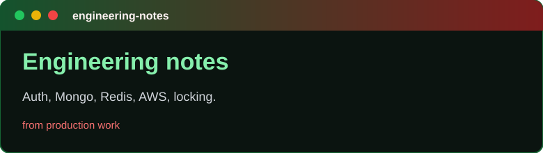
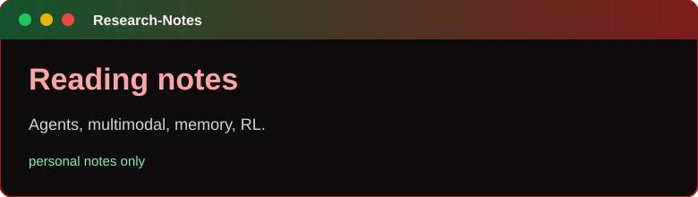
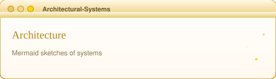
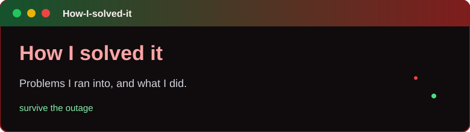

  

  

## Today

<!-- TODAY:START -->
### 28 Jul 2026

- Set up profile README and linked note repos.
- Added a nightly Action draft that can summarize the day's public commits into this section.
- Next: replace placeholder notes with ones from actual work.
<!-- TODAY:END -->

  

## Tech stack

  
  
  
  

  
  
  
  

  
  
  
  

  

## Notes

<table>
  <tr>
    <td width="50%" valign="top">
      
    </td>
    <td width="50%" valign="top">
      
    </td>
  </tr>
  <tr>
    <td width="50%" valign="top">
      
    </td>
    <td width="50%" valign="top">
      
    </td>
  </tr>
</table>
