# Hi, I'm Hamza.

Backend engineer.

Interested in distributed systems, AI infrastructure, robotics, and related reading.

---

## Today's engineering log

<!-- TODAY:START -->
### 28 Jul 2026

- Set up profile README and linked note repos.
- Added a nightly Action draft that can summarize the day's public commits into this section.
- Next: replace placeholder notes with ones from actual work.

<!-- TODAY:END -->

---

## Currently

- HMZ House
- Robotics experiments
- AI infrastructure experiments

---

## Notes & diagrams

| Repo | What it is |
|------|------------|
| [engineering-notes](https://github.com/hamzaskhan/engineering-notes) | Rough notes from building things |
| [Research-Notes](https://github.com/hamzaskhan/Research-Notes) | Personal notes on topics I'm reading about |
| [Architectural-Systems](https://github.com/hamzaskhan/Architectural-Systems) | Simple Mermaid sketches of systems |
| [How-I-solved-it](https://github.com/hamzaskhan/How-I-solved-it) | Write-ups of problems I ran into |

---

## Engineering notes

→ [engineering-notes](https://github.com/hamzaskhan/engineering-notes)

Drafts so far: JWT, Redis, Mongo transactions, locking, a few AI notes.

---

## Reading notes

→ [Research-Notes](https://github.com/hamzaskhan/Research-Notes)

Not papers or publications — just my own notes while reading.

---

## Architecture sketches

→ [Architectural-Systems](https://github.com/hamzaskhan/Architectural-Systems)

FastAPI auth, Mongo replica set, Redis cache, SQS, NestJS modules, a basic control loop.

---

## Other

- [How I solved it](https://github.com/hamzaskhan/How-I-solved-it) — problem write-ups (placeholders for now)

### Week 31

**Built**
- Profile README
- Daily log Action skeleton
- Placeholder folders in the note repos

**Next**
- Replace placeholders with real notes
- Run **Daily engineering log** (uses `GEMINI_API_KEY`)

---

## GitHub Metrics

  
  

---

## Contribution Snake

  <picture>
    <source media="(prefers-color-scheme: dark)" srcset="https://raw.githubusercontent.com/hamzaskhan/hamzaskhan/output/github-contribution-grid-snake-dark.svg" />
    <source media="(prefers-color-scheme: light)" srcset="https://raw.githubusercontent.com/hamzaskhan/hamzaskhan/output/github-contribution-grid-snake.svg" />
    
  </picture>

